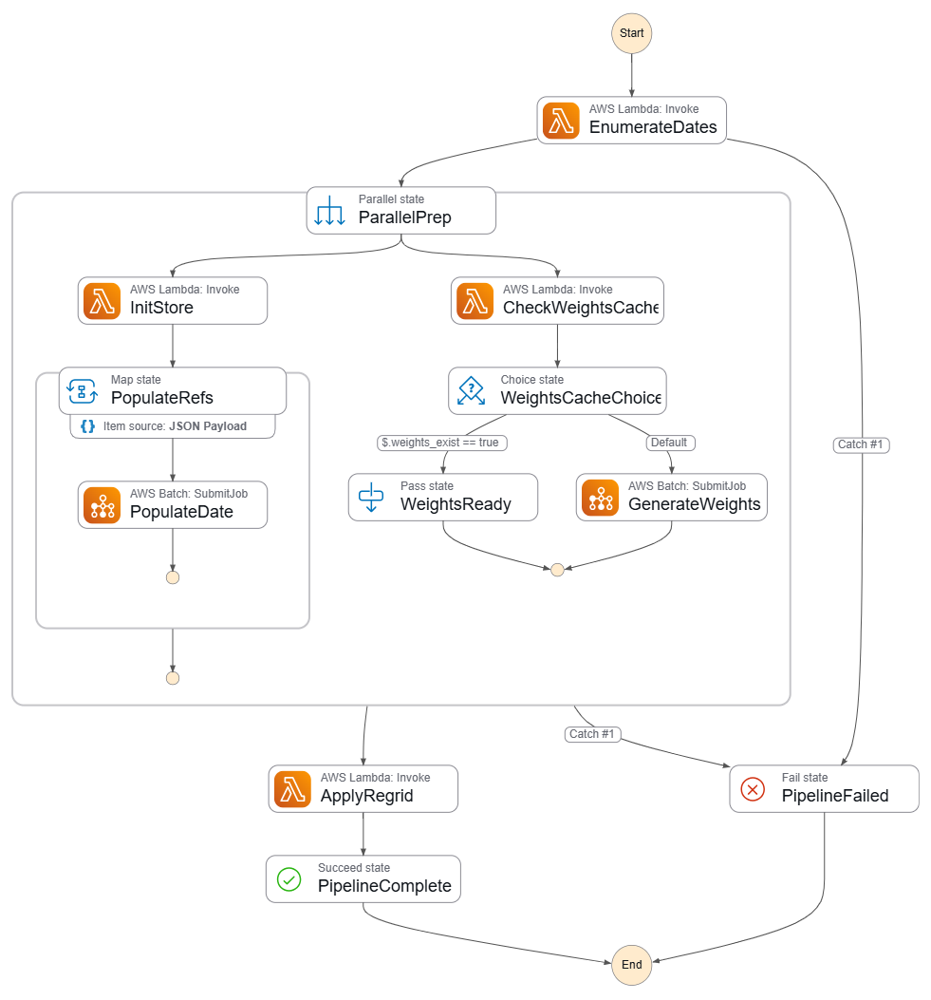

# JOIN Cloud Pipeline — Architecture

## Pipeline Diagram



### Stage descriptions

**Caller** — anything that triggers the pipeline: a developer, a scheduled EventBridge rule, or another automated process. Starts a Step Functions execution with the JSON input.

**EnumerateDates** — Lambda. Expands `start_date`/`end_date` into a list of `YYYYMMDD` strings. Feeds both parallel branches.

**Branch 1 — IceChunk store**

- **InitStore** — Lambda. Creates the Zarr v3 IceChunk store on S3 if it does not already exist. Dispatches to `schemas/<source>.py` to build the schema for the requested data source. Idempotent — safe to run repeatedly.
- **PopulateRefs** — Batch (Fargate Spot), one job per date. Dispatches to `sources/<source>.py` to fetch manifests and write virtual chunk references into the IceChunk store. No pixel data is copied to S3 — only byte-range pointers.
- **icechunk-stores** — The Zarr v3 IceChunk store on S3. Consumers open it directly; actual pixel data is streamed from JAXA on demand via the virtual refs.
- **JAXA G-Portal** — External JAXA server hosting the AMSR2 L3 HDF5 files. PopulateRefs reads byte-range manifests from here to build the virtual refs. Consumers also hit this directly at read time when accessing pixel data through the store.

**Branch 2 — ESMF weights**

- **CheckWeightsCache** — Lambda. Does a HEAD request on `weights_uri`. If the file exists the branch exits immediately; if not, weight generation runs.
- **Destination Grid** — The grid definition that tells ESMF where to interpolate to. Can be a LIS domain NetCDF on S3 (`lis_path`), a JSON bounding box passed as an env var (`dst_grid_spec`), or a pre-built SCRIP file on S3 (`dst_grid_uri`). In the default configuration this is `lis_input_NMP_1000m_missouri.nc` — a 1 km Lambert Conformal Conic grid over the Missouri River basin.
- **GenerateWeights** — Batch (Fargate Spot). Runs ESMF to compute a sparse interpolation matrix from the AMSR2 source grid to the destination grid. Writes the weight file to `weights_uri`. This is the most expensive step — typically 10–20 minutes — but only runs once per source/destination grid pair.
- **cached-weights** — The ESMF weight file on S3. A NetCDF4 containing a sparse matrix (`S`, `row`, `col`) that maps every AMSR2 source cell to one or more destination cells. Reused on every subsequent pipeline run for the same grid pair.

**ApplyRegrid** — Lambda (placeholder). Intended to apply the weights and write regridded output. Currently returns a pass-through response; regridding is performed by the consumer script (`regrid_consumer.py`) instead.

**Consumer** — any process that reads the pipeline outputs directly from S3. Opens the IceChunk store via `store_uri` and loads the weight matrix from `weights_uri`, then applies the sparse multiply locally. See `regrid_consumer.py` and the **Consumer Script** section below.

---

## Directory Layout

```
join-scratch/
└── cloud/                          ← all cloud deployment code
    ├── ARCHITECTURE.md             ← this file
    ├── batch/
    │   ├── regrid/                 ← ESMF weight-generation container
    │   │   ├── Dockerfile
    │   │   ├── regrid_job.py       ← dispatcher: reads SOURCE, loads sources/<source>.SRC_GRID_SPEC
    │   │   ├── sources/
    │   │   │   └── amsr2.py        ← AMSR2 source grid spec (SRC_GRID_SPEC only)
    │   │   └── build_and_push.sh
    │   └── icechunk/               ← IceChunk populate container
    │       ├── Dockerfile
    │       ├── populate_job.py     ← dispatcher: reads SOURCE, delegates to sources/<source>.py
    │       ├── sources/
    │       │   └── amsr2.py        ← AMSR2/JAXA G-Portal logic (insert_date)
    │       └── build_and_push.sh
    ├── lambda/
    │   ├── enumerate_dates/        ← expands date range into array for Map fan-out
    │   │   └── handler.py
    │   ├── init_store/             ← creates the IceChunk store if it does not exist
    │   │   ├── handler.py          ← dispatcher: reads source, delegates to schemas/<source>.py
    │   │   ├── schemas/
    │   │   │   └── amsr2.py        ← AMSR2 store schema (create_store interface)
    │   │   └── Dockerfile
    │   ├── check_weights/          ← checks whether weights file already exists on S3
    │   │   └── handler.py
    │   └── apply_regrid/           ← placeholder: apply weights + write output
    │       └── handler.py
    └── terraform/                  ← single deployment root
        ├── main.tf
        ├── variables.tf
        ├── outputs.tf
        └── modules/
            ├── ecr/                ← ECR repos (icechunk, regrid, init-store-lambda)
            ├── iam/                ← all roles (batch, lambda, sfn)
            ├── batch/              ← compute env, queue, job definitions
            ├── lambda/             ← Lambda functions
            └── stepfunctions/      ← state machine + state_machine.asl.json
```

### Adding a new data source

1. Add `cloud/batch/regrid/sources/<name>.py` exporting:
   ```python
   SRC_GRID_SPEC = {"nlat": ..., "nlon": ..., "lat_max": ..., "lat_min": ..., "lon_min": ..., "lon_max": ..., "title": "..."}
   ```
2. Add `cloud/batch/icechunk/sources/<name>.py` exporting:
   ```python
   def insert_date(bucket: str, prefix: str, date: str, force: bool) -> None: ...
   ```
3. Add `cloud/lambda/init_store/schemas/<name>.py` exporting:
   ```python
   def create_store(bucket: str, prefix: str) -> None: ...
   ```
4. Rebuild and push `join-esmf-regrid`, `join-icechunk`, and `join-init-store-lambda`.
5. Pass `"source": "<name>"` in the Step Functions execution input.

---

## Pipeline Arguments

These are passed as JSON when starting a Step Functions execution.

| Argument | Required | Default | Description |
|---|---|---|---|
| `source` | Yes | — | Data source identifier. Must match a module under `batch/regrid/sources/` (for grid spec) and `batch/icechunk/sources/` and `lambda/init_store/schemas/` (for store logic). Currently: `amsr2`. |
| `start_date` | Yes | — | First date to process, `YYYYMMDD`. |
| `end_date` | Yes | — | Last date to process, `YYYYMMDD` (inclusive). |
| `store_uri` | Yes | `s3://.../icechunk-stores/GCOM-W1-AMSR2-L3-SND` | S3 path to the IceChunk store root. The store holds virtual references to AMSR2 HDF5 byte-ranges on JAXA G-Portal — no actual pixel data is stored on S3. Created automatically on first run. |
| `weights_uri` | Yes | `s3://.../cached-weights/.../lis-1km-missouri.nc4` | S3 path where the ESMF weight file is (or will be) cached. The weight file is a sparse matrix encoding how to interpolate from the AMSR2 source grid to your destination grid. Generated on first run, reused on all subsequent runs for the same grid pair. |
| `dst_grid` | Yes | `s3://.../lis_input_NMP_1000m_missouri.nc` | Destination grid definition. Accepts three forms — see **Destination Grid Options** below. |
| `method` | No | `bilinear` | ESMF interpolation method. Options: `bilinear`, `conservative`, `patch`. |
| `recreate_store` | No | `false` | If `true`, delete and rebuild the IceChunk store from scratch. Use with caution — all existing virtual refs will be lost. |
| `force_repopulate` | No | `false` | If `true`, overwrite virtual refs for the requested dates even if they are already populated. |
| `force_regenerate` | No | `false` | If `true`, recompute and overwrite the weights file even if it already exists at `weights_uri`. |

### Destination Grid Options

`dst_grid` accepts three forms — the type is detected automatically:

| Form | Example | Description |
|---|---|---|
| S3 URI to a LIS domain NetCDF | `s3://.../lis_input_NMP_1000m_missouri.nc` | Reads 2D lat/lon and projection parameters from the file. Supports any projection (LCC, UTM, etc.) at any resolution. Detected by the presence of a `MAP_PROJECTION` global attribute. |
| S3 URI to a pre-built SCRIP NetCDF | `s3://.../my_grid.nc` | Use any custom grid you have already described in SCRIP format — projected, curvilinear, or irregular. |
| JSON bounding box | `{"nlat":360,"nlon":720,"lat_min":30,"lat_max":50,"lon_min":230,"lon_max":260}` | Defines a regular equirectangular (lat/lon degrees) grid inline. No files needed. All keys optional; defaults to the full AMSR2 global 0.1° grid. |

---

## Step Functions Execution Input

```json
{
  "source":           "amsr2",
  "start_date":       "20230101",
  "end_date":         "20230131",
  "store_uri":        "s3://airborne-smce-prod-user-bucket/JOIN/icechunk-stores/GCOM-W1-AMSR2-L3-SND",
  "weights_uri":      "s3://airborne-smce-prod-user-bucket/JOIN/cached-weights/GCOM-W1-AMSR2-L3-SND/lis-1km-missouri.nc4",
  "dst_grid":         "s3://airborne-smce-prod-user-bucket/JOIN/lis_input_NMP_1000m_missouri.nc",
  "method":           "bilinear",
  "recreate_store":   false,
  "force_repopulate": false,
  "force_regenerate": false
}
```

---

## What Consumers Receive

After the pipeline succeeds, consumers open the two S3 outputs directly — no pipeline access required:

```python
import icechunk, xarray, zarr, scipy.sparse, numpy as np, netCDF4 as nc

# 1. Open the virtual AMSR2 store (reads HDF5 byte-ranges from JAXA on demand)
storage = icechunk.s3_storage(bucket="airborne-smce-prod-user-bucket",
                              prefix="JOIN/icechunk-stores/GCOM-W1-AMSR2-L3-SND",
                              region="us-west-2")
repo    = icechunk.Repository.open(storage)
session = repo.readonly_session("main")
ds      = xarray.open_zarr(session.store, consolidated=False, zarr_format=3)

# 2. Load the ESMF sparse weight matrix
with nc.Dataset("cached-weights/.../lis-1km-missouri.nc4") as wf:
    S   = wf.variables["S"][:]
    row = wf.variables["row"][:] - 1   # 1-based → 0-based
    col = wf.variables["col"][:] - 1
W = scipy.sparse.csr_matrix((S, (row, col)))

# 3. Apply weights to a single date/orbit/band slice
raw  = ds["geophysical_data"].isel(time=0, orbit=0, band=0).values.astype("float32")
fill = np.isin(raw, [-32768, -32767])
src  = np.where(fill, 0.0, raw * 0.1)
mask = np.where(fill, 0.0, 1.0)
regridded = (W @ src.ravel()) / np.maximum(W @ mask.ravel(), 1e-12)
```

The `regrid_consumer.py` script wraps this pattern with Dask parallelism, date-range iteration, and NetCDF output.

---

## Consumer Script (`regrid_consumer.py`)

Run locally after the pipeline has populated the store and generated weights:

```bash
# via pixi task (dates and output path set in pyproject.toml)
pixi run regrid

# or directly with custom arguments
python3 cloud/regrid_consumer.py \
  --start-date 20230101 \
  --end-date   20230131 \
  --output-path _outputs/amsr2-jan2023.nc
```

### Arguments

| Argument | Required | Default | Description |
|---|---|---|---|
| `--start-date` | Yes | — | First date to regrid, `YYYYMMDD`. |
| `--end-date` | No | same as `--start-date` | Last date to regrid, `YYYYMMDD` (inclusive). |
| `--store-uri` | No | `s3://.../icechunk-stores/GCOM-W1-AMSR2-L3-SND` | S3 URI of the IceChunk store to read from. |
| `--weights-uri` | No | `s3://.../cached-weights/.../lis-1km-missouri.nc4` | S3 URI of the pre-computed ESMF weight file. Must have been generated by the pipeline for the same destination grid you want output on. |
| `--lis-path` | No | `s3://.../lis_input_NMP_1000m_missouri.nc` | S3 URI of the LIS domain file, used to read destination grid coordinates for the output NetCDF. |
| `--output-path` | No | `s3://.../JOIN/outputs/GCOM-W1-AMSR2-L3-SND-{start}-{end}.nc` | Where to write the regridded NetCDF. Accepts a local path or an `s3://` URI. |
| `--scheduler` | No | `threads` | Dask scheduler. Options: `synchronous` (no parallelism, good for debugging), `threads` (default), `distributed` (requires a running Dask cluster). |
| `--n-workers` | No | `4` | Number of threads when `--scheduler=threads`. |

### Output schema

The output NetCDF contains one variable per orbit × band combination:

| Variable | Dims | Description |
|---|---|---|
| `snow_depth_ascending` | `(time, south_north, west_east)` | Snow depth (cm), ascending orbit (~1:30 AM local) |
| `snow_depth_descending` | `(time, south_north, west_east)` | Snow depth (cm), descending orbit (~1:30 PM local) |
| `quality_flag_ascending` | `(time, south_north, west_east)` | Quality flag, ascending orbit |
| `quality_flag_descending` | `(time, south_north, west_east)` | Quality flag, descending orbit |
| `lat` | `(south_north, west_east)` | 2D latitude of each destination cell (degrees north) |
| `lon` | `(south_north, west_east)` | 2D longitude of each destination cell (degrees east) |
| `crs` | scalar | Grid mapping variable (Lambert Conformal Conic, CF convention) |
